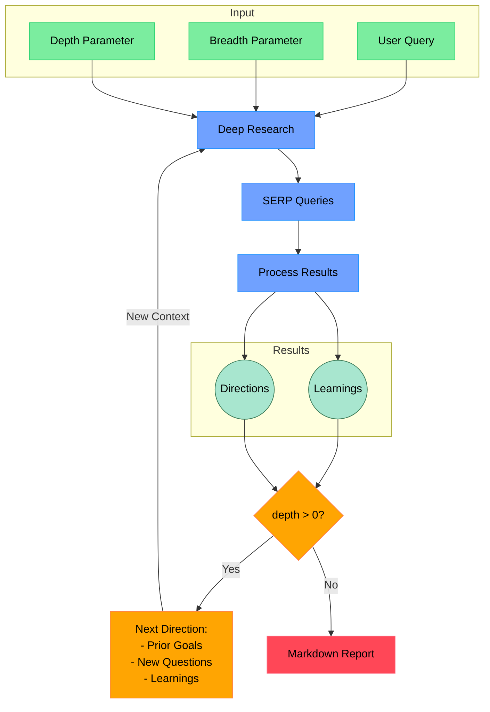

# Open Deep Research

An AI-powered research assistant that performs iterative, deep research on any topic by combining search engines, web scraping, and large language models. Now includes specialized **vulnerability research** capabilities for blockchain security analysis.

The goal of this repo is to provide the simplest implementation of a deep research agent - e.g. an agent that can refine its research direction over time and deep dive into a topic. Goal is to keep the repo size at <500 LoC so it is easy to understand and build on top of.

If you like this project, please consider starring it and giving me a follow on [X/Twitter](https://x.dzhng). This project is sponsored by [Aomni](https://aomni.com).

## How It Works



## Features

- **Iterative Research**: Performs deep research by iteratively generating search queries, processing results, and diving deeper based on findings
- **Intelligent Query Generation**: Uses LLMs to generate targeted search queries based on research goals and previous findings
- **Depth & Breadth Control**: Configurable parameters to control how wide (breadth) and deep (depth) the research goes
- **Smart Follow-up**: Generates follow-up questions to better understand research needs
- **Comprehensive Reports**: Produces detailed markdown reports with findings and sources
- **Concurrent Processing**: Handles multiple searches and result processing in parallel for efficiency

### 🔒 NEW: Vulnerability Research Mode

- **Blockchain Security Analysis**: Specialized research mode for finding vulnerabilities in smart contracts and DeFi protocols
- **Bug Bounty Platform Integration**: Automatically scrapes ImmuneFi, Code4rena, HackerOne, and Bugcrowd for active bounty programs
- **GitHub Repository Scanner**: Finds and analyzes smart contract repositories with potential security issues
- **Static Code Analysis**: Built-in Solidity vulnerability detection engine with 10+ vulnerability patterns
- **Ethers.js Integration**: Blockchain connectivity for on-chain analysis and contract interaction
- **Risk Assessment**: Automated prioritization of targets based on bounty rewards, repository metrics, and vulnerability findings

## Requirements

- Node.js environment
- API keys for:
  - Firecrawl API (for web search and content extraction)
  - OpenAI API (for o3 mini model)
  - GitHub API token (optional, for vulnerability research mode)
  - Ethereum RPC endpoint (optional, for blockchain analysis)

## Setup

### Node.js

1. Clone the repository
2. Install dependencies:

```bash
npm install
```

3. Set up environment variables in a `.env.local` file:

```bash
FIRECRAWL_KEY="your_firecrawl_key"
# If you want to use your self-hosted Firecrawl, add the following below:
# FIRECRAWL_BASE_URL="http://localhost:3002"

OPENAI_KEY="your_openai_key"

# Optional: For vulnerability research mode
GITHUB_TOKEN="your_github_token"
ETHERS_RPC_URL="your_ethereum_rpc_url"
```

To use local LLM, comment out `OPENAI_KEY` and instead uncomment `OPENAI_ENDPOINT` and `OPENAI_MODEL`:

- Set `OPENAI_ENDPOINT` to the address of your local server (eg."http://localhost:1234/v1")
- Set `OPENAI_MODEL` to the name of the model loaded in your local server.

### Docker

1. Clone the repository
2. Rename `.env.example` to `.env.local` and set your API keys

3. Run `docker build -f Dockerfile`

4. Run the Docker image:

```bash
docker compose up -d
```

5. Execute `npm run docker` in the docker service:

```bash
docker exec -it deep-research npm run docker
```

## Usage

Run the research assistant:

```bash
npm start
```

You'll be prompted to choose a research mode:

### General Research Mode

1. Enter your research query
2. Specify research breadth (recommended: 3-10, default: 4)
3. Specify research depth (recommended: 1-5, default: 2)
4. Answer follow-up questions to refine the research direction

### 🔒 Vulnerability Research Mode

1. Enter your vulnerability/security research topic
2. Configure analysis parameters:
   - Maximum targets to analyze (default: 20)
   - Focus on bug bounty programs (recommended: yes)
   - Include static code analysis (recommended: yes)
   - Minimum GitHub stars (default: 50)

The system will then:

1. **Bug Bounty Discovery**: Scan major platforms for relevant programs
2. **Repository Analysis**: Find smart contract repos matching your criteria
3. **Static Analysis**: Analyze contract code for vulnerability patterns
4. **Risk Assessment**: Prioritize targets based on multiple factors
5. **Generate Report**: Create comprehensive vulnerability research report

Both modes will generate comprehensive markdown reports saved to your working directory.

**📚 For detailed vulnerability research documentation, see [VULNERABILITY_RESEARCH.md](./VULNERABILITY_RESEARCH.md)**

### Concurrency

If you have a paid version of Firecrawl or a local version, feel free to increase the `ConcurrencyLimit` by setting the `CONCURRENCY_LIMIT` environment variable so it runs faster.

If you have a free version, you may sometimes run into rate limit errors, you can reduce the limit to 1 (but it will run a lot slower).

### DeepSeek R1

Deep research performs great on R1! We use [Fireworks](http://fireworks.ai) as the main provider for the R1 model. To use R1, simply set a Fireworks API key:

```bash
FIREWORKS_KEY="api_key"
```

The system will automatically switch over to use R1 instead of `o3-mini` when the key is detected.

### Custom endpoints and models

There are 2 other optional env vars that lets you tweak the endpoint (for other OpenAI compatible APIs like OpenRouter or Gemini) as well as the model string.

```bash
OPENAI_ENDPOINT="custom_endpoint"
CUSTOM_MODEL="custom_model"
```

## How It Works

### General Research Mode

1. **Initial Setup**

   - Takes user query and research parameters (breadth & depth)
   - Generates follow-up questions to understand research needs better

2. **Deep Research Process**

   - Generates multiple SERP queries based on research goals
   - Processes search results to extract key learnings
   - Generates follow-up research directions

3. **Recursive Exploration**

   - If depth > 0, takes new research directions and continues exploration
   - Each iteration builds on previous learnings
   - Maintains context of research goals and findings

4. **Report Generation**
   - Compiles all findings into a comprehensive markdown report
   - Includes all sources and references
   - Organizes information in a clear, readable format

### 🔒 Vulnerability Research Mode

1. **Bug Bounty Platform Scraping**
   - Scans ImmuneFi, Code4rena, HackerOne, and Bugcrowd
   - Identifies active programs related to your research topic
   - Extracts reward information and program details

2. **GitHub Repository Discovery**
   - Searches for smart contract repositories
   - Filters by stars, bounty indicators, and relevance
   - Analyzes repository metadata and topics

3. **Static Code Analysis**
   - Downloads and analyzes smart contract source code
   - Detects common vulnerability patterns:
     - Reentrancy attacks
     - Access control issues
     - Integer overflow/underflow
     - Weak randomness
     - Gas optimization issues
     - And more...

4. **Risk Assessment & Prioritization**
   - Calculates risk scores based on multiple factors
   - Prioritizes targets by bounty rewards and vulnerability findings
   - Generates actionable recommendations

5. **Comprehensive Reporting**
   - Creates detailed vulnerability research reports
   - Includes target analysis, vulnerability findings, and remediation suggestions
   - Provides clear next steps for security researchers
  
## Community implementations

**Python**: https://github.com/Finance-LLMs/deep-research-python

## License

MIT License - feel free to use and modify as needed.
